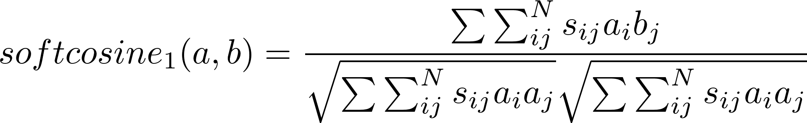

# INCA Analysis functionality: Similarity between documents

## What it is

Calculating the pairwise similarity between two documents either using cosine similarity or softcosine similarity.
This analysis functionality built into INCA takes two types of documents (called **source** and **target**) and calculates the similarity between each source and target. For this sake, each document is represented in terms of the Vector Space Model (VSM) as a vector of term weights, and the similarity between two documents is estimated by taking the cosine of the angle between the vectors.

When the angle between two document vectors is small, they are pointing roughly the same direction because they share many tokens in common. This procedure is especially helpful when looking for copy-pasted content as for this analysis the VSM features are considered to be independent &mdash; thus two words are seen as entirely different.

The other option &mdash; soft cosine similarity &mdash; can however do some more refined similarity analyses. In case of the cosine similarity [Sidorov (2014)](http://www.cys.cic.ipn.mx/ojs/index.php/CyS/article/view/2043) notes: "For example, words 'play' and 'game' are of course different words and thus should be mapped to different dimensions in SVM; yet it is obvious that they are related" (p.492). Thus, he introduced a new measure, termed "soft cosine measure" (p.491) which can be used to calculate the soft similarity between documents. By including a measure of similarity of word vectors derived from a larger training corpus into the original cosine similarity formula, the equivalency of words can more accurately be detected, leading to



As the soft cosine similarity uses a sparse matrix for similarity queries, it is considerably faster than other approaches in this domain (e.g. Word Movers Distance, developed by [Kusner, 2015](http://proceedings.mlr.press/v37/kusnerb15.pdf)) while showing almost [no loss in precision](https://github.com/witiko/gensim/blob/softcossim/docs/notebooks/soft\_cosine\_tutorial.ipynb).

Thus, with these two analysis functions you can decide whether you want to have the similarity of documents based on their exact words or also based on similar meanings (detecting that "The president greets the press in Chicago" and "Trump speaks to the media in Illinois" essentially mean the same thing).

**When running the cosine similarity analysis, the following steps are executed:**
- After retrieving all source and target articles, the documents are transformed to vectors and then the dot product of each two document-vectors that should be compared is calculated (dot product: multiply a vector by another vector). From the resulting matrix the cosine similarity can be extracted. More info on cosine similarity can for example be found [here](https://masongallo.github.io/machine/learning,/python/2016/07/29/cosine-similarity.html)

**When running the soft cosine similarity analysis, the following steps are executed:**

- A dictionary (creating word - id mappings) out of the entire corpus (all source and target documents). This dictionary is then transformed into a TF-IDF matrix (Term Frequency - Inverse Document Frequency). Those two components save as input for creating a similarity matrix. Out of the target documents an index is created, using doc2bow, dictionary and tfidf. This index is the representation of your target documents that you need to compare your source documents to.

- Each source document is also transformed (using doc2bow, dictionary and tfidf) and put into a generator

- Now, for each source document in the generator the similarity to all documents in the index is computed

- All the similarities are put into a dataframe, each row showing: The ID of the source and target document that were compared, their similarity, their dates (to see how far they were apart) and their doctypes.

You have to supply a few parameters:
- What doctypes you want to compare. Multiple doctypes can be supplied as a list (source, target)
- What the textfield of the two doctypes is you want to compare (sourcetext, targettext). For the softcosine analysis, both are set to 'text' by default. 
    - **Warning:** You should not use these analyses with unprocessed text (i.e. including stopwords etc.) as you then get inflated similarity coefficients. Thus, it is advised to first use some of the basic text processing steps, save the results in a document field, and supply this field to the analyses.
- What the datefields of the two doctypes are (sourcedate, targetdate). For the softcosine analysis, both are set to 'publication_date' by default.

Only for the soft cosine analysis:
- For the soft cosine analysis you also have to supply a path to a pre-trained word2vec model. Help on how to do this can be found here: https://rare-technologies.com/word2vec-tutorial/ (path_to_model)


In addition, you also have different options to customize:
- You can add a threshold (for example 0.6). In this case, only source-target pairs whose similarity passes this threshold are saved in the resulting document (threshold).
- You can add a date range. Then only documents within this date range are processed (you can supply either one or both). A date format is yyyy-MM-dd (from_time, to_time).
- You can add keywords that need to be present in the textfield of the source or target. You can either supply a string (e.g. 'groenlinks') or a list of words (e.g. ['groenlinks', 'cda']). In the second case both words need to be present in the text. This option allows you to select more specific texts to compare.
- You can choose to run the analysis on specific groups of articles by adding a condition for the source and/or target. You need to supply a pre-existing field and its value in the form of a dict. For instance, to run the analysis only on articles with 1 in the field 'topic' add {'topic':1} (condition_target, condition_source).
- You can specifiy 'days_before' and 'days_after'. In this case, only target documents within this range around the source are compared to it &mdash; this is for example important if you assume that documents too far apart (e.g. a year) should not be compared for similarity (i.e. because influences between source and target are believed to be more short-term). As an important side-effect, you have far less comparisons in this case as you do not calculate similarities between documents where it does not make sense. In this case, each source gets its own index it is compared to &mdash; however, your resulting document will have the same information as before (days_before, days_after).
- You can choose whether you want a csv file or a pandas dataframe (saved as pkl) as a result (to_csv).
- You can also specify the destination where it should be saved. By default it is saved in a folder called 'comparisons' (destination).
- For the softcosine similarity, you can choose to export the results (target, source and similarity score) as a pajek file, in addition to a csv or pickle file. By default, this option is set to False (to_pajek).
- For the cosine analysis you can also decide whether you want to calculate the cosine similarity, the levenshtein distance (number of deletions, insertions, or substitutions required to transform the source text into the target text) or both (method).


## Example

For this example, we assume that you have a running instance of ElasticSearch.

### Collect some documents

First of all, we need a source doctype (i.e. 'nu') and a target doctype (i.e. 'ad (www)').  You can check which doctypes are in the database by running the following command.

```python
myinca.database.list_doctypes()
```

### Process the documents

As mentioned above, it is crucial to first do some processing steps with the data. More information on how to do this can be found in the document [howto_process](https://github.com/uvacw/inca/blob/similarities/doc/howto_process.md). Useful steps to consider are for example stopwords and punctuation removal or stemming.

### Calculate similarities

Now you just need to fill in all the different parameters to run the function. After this, you will have a CSV file or pkl file either in your specified destination or in the 'comparisons' folder.

#### Cosine similarity
```python
myinca.analysis.cosine_similarity().fit('nu', 'text_processed', 'publication_date', 'ad (www)', 'text_processed', 'publication_date', days_before = 2, days_after = 2, from_time = '2013-09-01', to_time = '2013-09-02', to_csv = True, threshold = 0.6, method = 'cosine')
```

#### Softcosine similarity
```python
myinca.analysis.softcosine_similarity().fit('/home/mymodel', 'nu', 'ad (www)', sourcetext= 'text_processed', keyword_source= 'vvd', condition_source = '{'topic':1}, days_before = 2, days_after = 2, from_time = '2013-09-01', to_time = '2013-09-02', to_csv = True, to_pajek = False, threshold = 0.6, destination = '/home/exports/')
```
